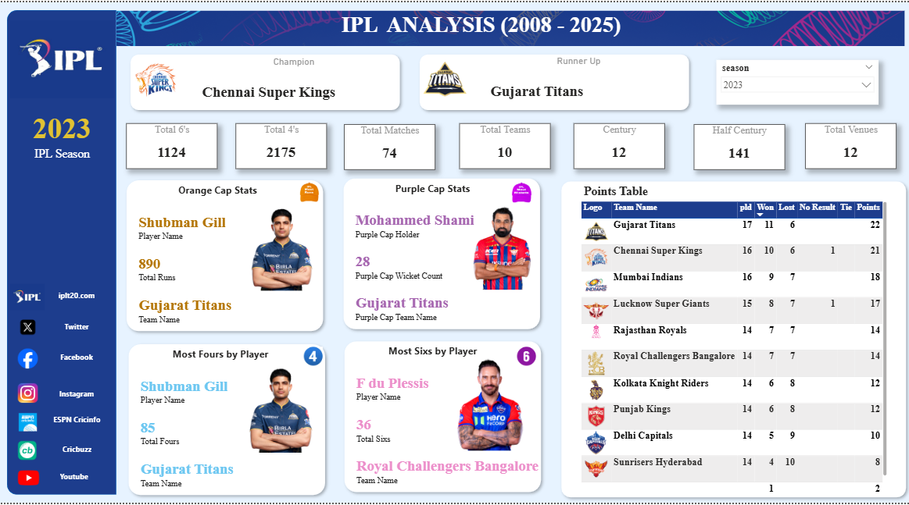
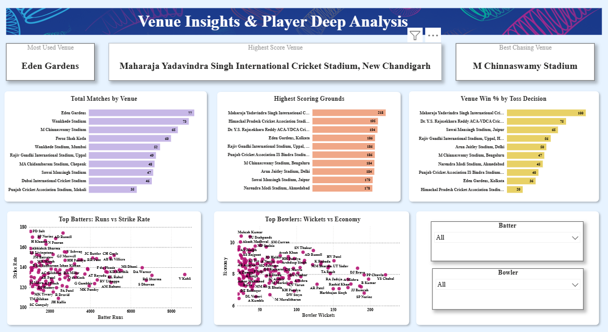
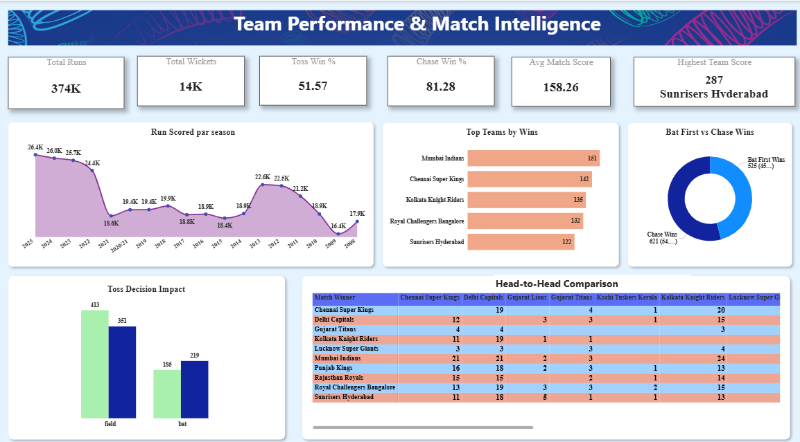

# 🏏 IPL Performance Analysis Dashboard (2008–2025)


---

## 📌 Project Overview

This project presents an **end-to-end sports analytics solution** for the Indian Premier League covering **18 seasons (2008–2025)** across match performance, team dominance, venue intelligence, and player deep analysis.

The project combines:
- 📊 **Power BI** — 3 interactive business intelligence dashboards
- 🧮 **DAX Measures** — Advanced KPI calculations from ball-by-ball data
- ☁️ **Power BI Service** — Cloud deployment for online access & sharing

> The dataset covers 1,169 IPL matches with ball-by-ball delivery data analyzed in Power BI to produce cricket analytics insights across season, team, venue, and player levels.

---

## 🎯 Project Objectives

This project answers key analytical questions such as:

- Which franchises dominated IPL across multiple seasons?
- How did season champions and runners-up change over time?
- Which players led batting and bowling across seasons?
- Did toss decisions influence match outcomes?
- Which venues hosted the most matches and produced the highest scores?
- Is chasing or batting first more advantageous in IPL?
- How do batting strike rate and bowling economy vary across players?

---

## 📊 Dashboard Screenshots

### 1. IPL Season Overview


### 2. Team Performance & Match Intelligence


### 3. Venue Insights & Player Deep Analysis


---

## 🛠️ Tools & Technologies

| Tool | Purpose |
|---|---|
| Power BI Desktop | Dashboard development |
| Power BI Service | Cloud publishing & sharing |
| DAX | Calculated measures & KPIs |
| Power Query | Data cleaning & transformation |
| CSV Files | Raw data source |
| Data Modeling | Table relationships |

---

## ⚙️ Setup & Usage

### Step 1 — Clone the Repository
```bash
git clone https://github.com/abhi14324/ipl-performance-analysis-powerbi-2008-2025.git
cd ipl-performance-analysis-powerbi-2008-2025
```

### Step 2 — Open Power BI Dashboard
1. Open `IPL_Analysis_Dashboard.pbix` in Power BI Desktop
2. Click **Home → Refresh** to load the latest CSV data
3. Explore all 3 dashboard pages using the season slicer

### Step 3 — View Live Dashboard
🔗 **Live Dashboard:** [Click here to open in Power BI Service](https://app.powerbi.com/groups/ee6db914-0c58-4f2b-b298-6cee389cec20/reports/81dc419f-7238-451d-8ff4-d4b748bab610/3e75a960ca9356601e79?experience=power-bi)

---

## 📁 Project Structure

```
ipl-performance-analysis-powerbi-2008-2025/
│
├── dataset/
│   ├── ipl_matches_data.csv          ← 1,169 match records (2008–2025)
│   ├── ball_by_ball_data.csv         ← Delivery-level data for all mat
│   ├── players_data.csv              ← Player profiles and styles
│   └── teams_data.csv                ← Team names, logos, season info
│
├── screenshots/
│   ├── season_overview.png
│   ├── team_match_intelligence.png
│   └── venue_player_analysis.png
│
├── documentation/
│   └── IPL_Project_Documentation.md  ← Full project documentation
│
├── IPL_Analysis_Dashboard.pbix       ← Power BI dashboard file
└── README.md
```

---

## 📋 Dataset Description

The dataset covers **1,169 IPL matches** across **18 seasons** from multiple CSV files:

### ipl_matches_data.csv

| Column | Description |
|---|---|
| match_id | Unique match identifier |
| season | IPL season year (2008–2025) |
| venue | Stadium name |
| city | Host city |
| toss_winner | Team that won the toss |
| toss_decision | bat or field |
| match_winner | Winning team name |
| result | win / no result / tie |
| win_by_runs | Margin if batting team won |
| win_by_wickets | Margin if chasing team won |
| stage | Qualifier / Eliminator / Final |

### ball_by_ball_data.csv

| Column | Description |
|---|---|
| match_id | Links to match table |
| innings | Innings number (1 or 2) |
| batter | Batter name |
| bowler | Bowler name |
| batter_runs | Runs scored off bat |
| total_runs | Total runs including extras |
| is_wicket | 1 if wicket fell, else 0 |
| wicket_kind | Type of dismissal |
| player_out | Dismissed player name |
| is_wide_ball | 1 if wide delivery |
| is_no_ball | 1 if no-ball delivery |
| wide_ball_runs | Runs from wide |
| no_ball_runs | Runs from no-ball |
| team_batting | Batting team name |
| is_super_over | 1 if super over delivery |

---

## 📈 Power BI Dashboards

### Dashboard 1 — IPL Season Overview
> Season-level executive summary for any IPL year from 2008 to 2025

**Season Slicer** allows selecting any year dynamically — all visuals update automatically.

**KPI Cards:** Total 6s · Total 4s · Total Matches · Total Teams · Centuries · Half-Centuries · Total Venues

**Visuals:**
- Champion & Runner-up cards with team logos
- Orange Cap holder (top run-scorer) with player photo
- Purple Cap holder (top wicket-taker) with player photo
- Most Fours by Player with player photo
- Most Sixes by Player with player photo
- Full Points Table with team logos, W/L/NR/Points

**Key Insights:**
- 🏆 2025 Champion — Royal Challengers Bangalore
- 🎯 2023 Champion — Chennai Super Kings
- 🏏 Season batting and bowling leaders change dynamically per year
- 📋 Full standings visible for any of the 18 seasons

---

### Dashboard 2 — Team Performance & Match Intelligence
> Historical trend-based team analysis across all 18 IPL seasons

**KPI Cards:** Total Runs · Total Wickets · Toss Win % · Chase Win % · Avg Match Score · Highest Team Score

**Visuals:**
- Runs Scored Per Season (Line Chart)
- Top Teams by Wins (Horizontal Bar Chart)
- Bat First vs Chase Wins (Donut Chart)
- Toss Decision Impact (Grouped Bar Chart)
- Head-to-Head Comparison (Matrix — all teams vs all teams)

**Key Insights:**
- 🥇 Mumbai Indians are the most successful franchise with **151 wins**
- 🏃 Chasing teams win **54%+** of IPL matches
- 🎲 Toss winners win only **51.57%** of matches — minimal advantage
- 🔥 Highest team score ever — **287 by Sunrisers Hyderabad**
- 📊 Average innings score across all seasons — **158.26 runs**

---

### Dashboard 3 — Venue Insights & Player Deep Analysis
> Stadium intelligence and player performance pattern analysis

**KPI Cards:** Most Used Venue · Highest Score Venue · Best Chasing Venue

**Visuals:**
- Total Matches by Venue (Horizontal Bar Chart — Top 10)
- Highest Scoring Grounds (Horizontal Bar Chart — Avg innings score)
- Venue Win % by Toss Decision (Bar Chart)
- Top Batters: Runs vs Strike Rate (Scatter Plot)
- Top Bowlers: Wickets vs Economy (Scatter Plot)
- Batter & Bowler Slicers for individual player filtering

**Key Insights:**
- 🏟️ **Eden Gardens** hosts the most matches — 77 total
- 💥 **Mullanpur Stadium** produces highest avg innings score — 218 runs
- 🏃 **M Chinnaswamy Stadium** strongly favours chasing teams
- 🏏 High strike rate does not always correlate with highest run totals
- 🎳 Bowlers with high wicket counts tend to have slightly higher economy rates

---

## 📐 Key DAX Measures

```DAX
-- Total Runs (from ball-by-ball)
Total Runs =
SUM( ball_by_ball[batter_runs] )

-- Total Wickets (bowler credit only, excludes run outs)
Total Wickets =
CALCULATE(
    COUNTROWS( ball_by_ball ),
    ball_by_ball[is_wicket] = 1,
    ball_by_ball[wicket_kind] <> "run out"
)

-- Toss Win %
Toss Win % =
DIVIDE(
    CALCULATE(
        COUNTROWS( ipl_matches_data ),
        ipl_matches_data[toss_winner] = ipl_matches_data[match_winner],
        ipl_matches_data[result] = "win"
    ),
    CALCULATE(
        COUNTROWS( ipl_matches_data ),
        ipl_matches_data[result] = "win"
    ),
    0
) * 100

-- Chase Wins
Chase Wins =
CALCULATE(
    COUNTROWS( ipl_matches_data ),
    ipl_matches_data[result] = "win",
    ( ipl_matches_data[toss_decision] = "field"
        && ipl_matches_data[toss_winner] = ipl_matches_data[match_winner] )
    ||
    ( ipl_matches_data[toss_decision] = "bat"
        && ipl_matches_data[toss_winner] <> ipl_matches_data[match_winner] )
)

-- Avg Match Score (per innings)
Avg Match Score =
AVERAGEX(
    SUMMARIZE(
        ball_by_ball,
        ball_by_ball[match_id],
        ball_by_ball[innings],
        "Innings Runs", SUM( ball_by_ball[total_runs] )
    ),
    [Innings Runs]
)

-- Highest Team Score
Highest Team Score =
MAXX(
    SUMMARIZE(
        ball_by_ball,
        ball_by_ball[match_id],
        ball_by_ball[innings],
        ball_by_ball[team_batting],
        "Innings Total", SUM( ball_by_ball[total_runs] )
    ),
    [Innings Total]
)

-- Strike Rate
Strike Rate =
DIVIDE( [Total Runs], [Total Balls Faced], 0 ) * 100

-- Economy Rate
Economy Rate =
DIVIDE( [Total Runs Conceded], [Total Balls Bowled], 0 ) * 6

-- Batting Average
Batting Average =
DIVIDE( [Total Runs], [Total Dismissals], 0 )

-- Bowling Average
Bowling Average =
DIVIDE( [Total Runs Conceded], [Total Wickets], 0 )

-- Avg Innings Score At Venue
Avg Innings Score At Venue =
AVERAGEX(
    SUMMARIZE(
        ball_by_ball,
        ball_by_ball[match_id],
        ball_by_ball[innings],
        "Innings Total", SUM( ball_by_ball[total_runs] )
    ),
    [Innings Total]
)

-- Chase Win % At Venue
Chase Win % At Venue =
DIVIDE(
    [Chase Wins At Venue],
    CALCULATE(
        COUNTROWS( ipl_matches_data ),
        ipl_matches_data[result] = "win"
    ),
    0
) * 100
```

---

## 🔍 Key Findings

| # | Finding | Result |
|---|---|---|
| 1 | Most successful franchise | Mumbai Indians — 151 wins |
| 2 | 2025 IPL Champion | Royal Challengers Bangalore |
| 3 | Highest team score ever | 287 — Sunrisers Hyderabad |
| 4 | Average innings score | 158.26 runs |
| 5 | Chase win rate | 54%+ of all matches |
| 6 | Toss advantage | Only 51.57% — minimal impact |
| 7 | Most used venue | Eden Gardens — 77 matches |
| 8 | Highest scoring venue | Mullanpur — 218 avg innings score |
| 9 | Best chasing venue | M Chinnaswamy Stadium, Bengaluru |
| 10 | Total runs across all seasons | 374K+ runs |

---

## ☁️ Power BI Service Deployment

The dashboard has been published to Power BI Service for cloud access.

**🔗 View Live Dashboard:** [Click here to open in Power BI Service](https://app.powerbi.com/groups/ee6db914-0c58-4f2b-b298-6cee389cec20/reports/81dc419f-7238-451d-8ff4-d4b748bab610/3e75a960ca9356601e79?experience=power-bi)

Power BI Service enables:
- 🌐 Online dashboard access from any device
- 🔗 Easy report sharing with stakeholders
- 🔄 Scheduled data refresh capability
- 📱 Mobile-friendly dashboard viewing
- 👔 Executive-level presentation ready

---

## 🚀 Future Improvements

- [ ] Add win probability model using match situation data
- [ ] Add player drillthrough pages with full career stats
- [ ] Add partnership analytics (batting pairs)
- [ ] Add venue-based season filters
- [ ] Add batting order analysis (openers vs middle order)
- [ ] Add toss decision trend by venue over seasons
- [ ] Connect live IPL data source for real-time refresh

---

## 👤 Author

**Abhishek Kumar**

[](https://linkedin.com/in/abhishek-kumar-a53b46309)
[](https://github.com/abhi14324)
[](mailto:ak38022246637@gmail.com)

---

## 📄 License

This project is open source and available under the [MIT License](LICENSE).

---

> ⭐ If you found this project helpful, please give it a star on GitHub!
